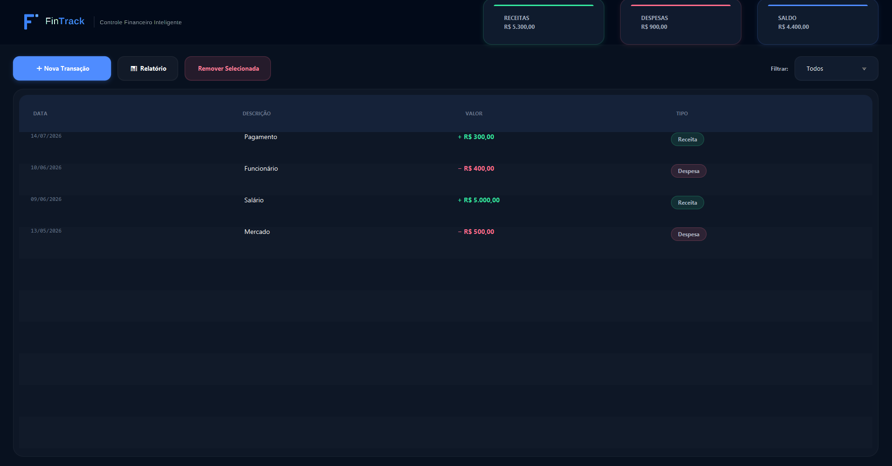
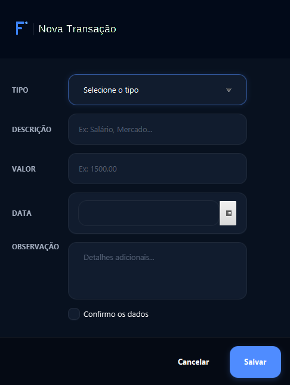
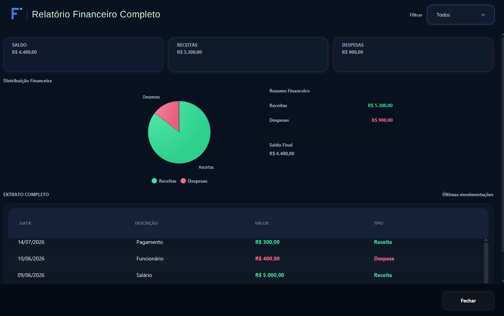

<div align="center">


# FinTrack

**Sistema de Controle Financeiro Inteligente desenvolvido em JavaFX.**


</div>

---

## Sobre o Projeto

O FinTrack é uma aplicação desktop desenvolvida para auxiliar usuários no gerenciamento de finanças pessoais, permitindo o controle de receitas, despesas, saldo e relatórios financeiros de forma simples e intuitiva.


---

## Telas

### Painel Principal



### Nova Transação



### Relatório Financeiro



---

## Funcionalidades

- Cadastro de receitas
- Cadastro de despesas
- Controle de saldo financeiro
- Dashboard com indicadores financeiros
- Relatórios de movimentações
- Persistência de dados com banco SQLite
- Interface gráfica moderna utilizando JavaFX

---

## Tecnologias Utilizadas

- Java 21
- JavaFX
- SQLite
- JDBC
- Maven
- CSS

---

## Estrutura do Projeto

```text
src/
├── main/
│   ├── java/
│   │   ├── app/
│   │   ├── controller/
│   │   ├── model/
│   │   ├── repository/
│   │   ├── service/
│   │   └── utils/
│   └── resources/
│       ├── css/
│       ├── images/
│       └── view/
└── test/
```

---

## Como Executar

1. Clone o repositório:

```bash
git clone https://github.com/anaflaviabitu/FinTrack.git
```

2. Abra o projeto em uma IDE compatível com Java e Maven.

3. Execute a classe `FinApp.java`.

---

## Desenvolvedora

Ana Flávia Bitu

---

## Licença

Projeto desenvolvido para fins acadêmicos e educacionais.
